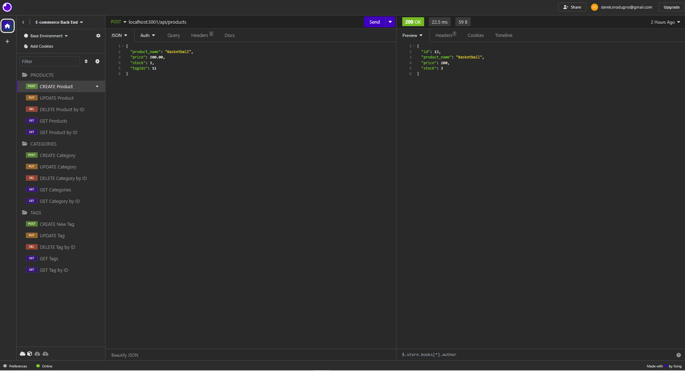

# E-commerce Back End 

## Description
- My goal for this project was to create a working E-Commerce backend.
  I built this project using JavaScript, Node.js, Sequelize, and MySQL2.
  This app allows the user to interact with an e-commerce database.
  I learned from making this application how to use Sequelize and Insomnia.

## Installation
- This application requires Node.js, Express.js, MySQL2, and Sequelize.

## Usage
- Source the database with MySql. Enter 'node seeds/index.js' in the terminal to seed the database. Enter 'node server.js' to start the server.

Video Demonstration:

https://drive.google.com/file/d/1WSVQ3ujOncJ-88HxiCdpG1zRwAbeiLro/view

## Credits
N/A

## License
MIT
